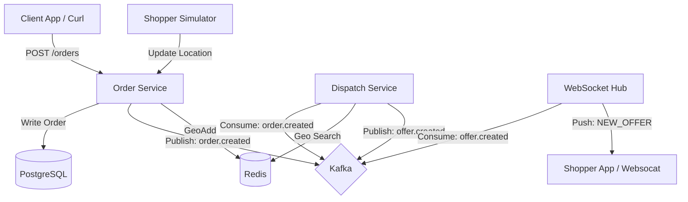
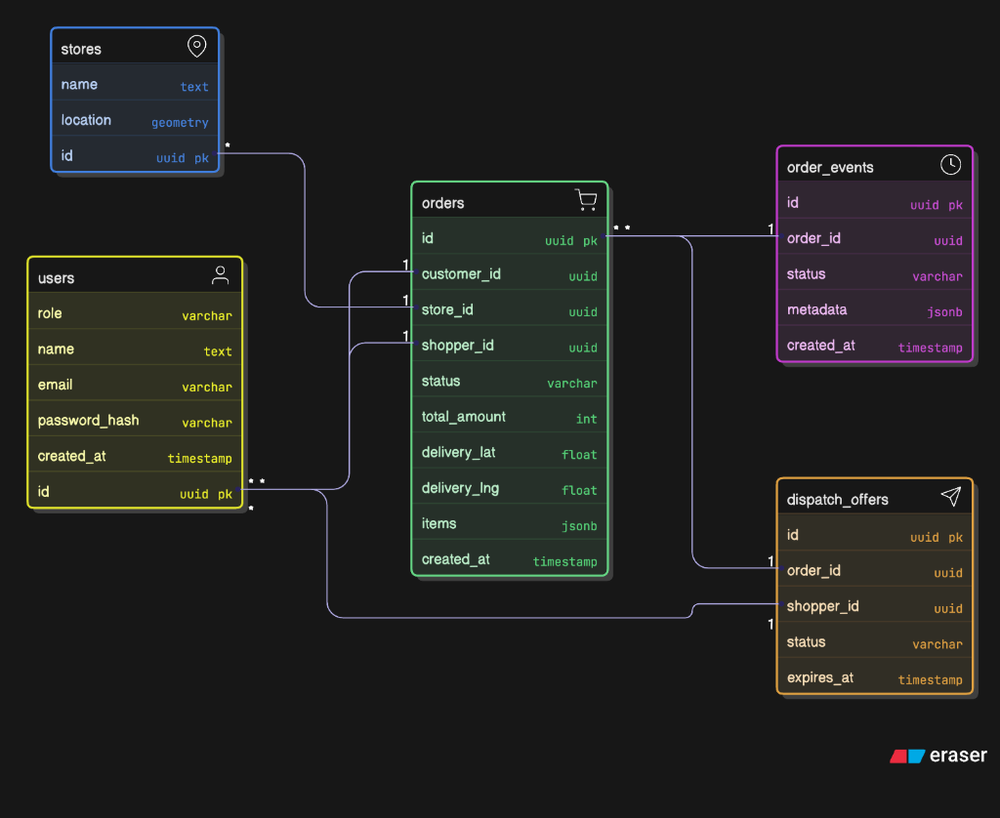
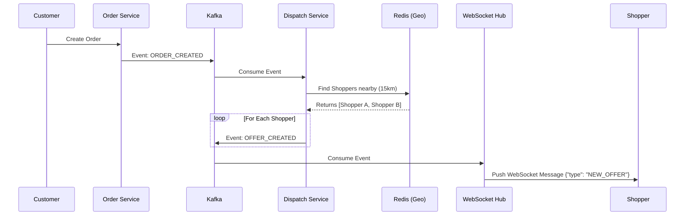

# 📦 Real-Time Distributed Order Tracker ("Shipt Clone" Backend)

A high-performance, event-driven logistics backend built with **Go**, **Kafka**, **Redis**, and **PostgreSQL**.

This system handles order ingestion, real-time geospatial dispatching to nearby shoppers, and atomic order claiming, simulating the core logistics engine of a delivery platform like Shipt or Instacart.

## 🎥 Demo
[](https://www.youtube.com/watch?v=dI_CtcXSh2s)

## 🚀 Key Features

*   **Real-Time Geospatial Dispatching**: Uses **Redis Geo** to instantly find shoppers within a 15km radius of a store.
*   **Event-Driven Architecture**: Decoupled services using **Apache Kafka** for asynchronous communication (Order Service -> Dispatch Service -> Notification Service).
*   **WebSocket Push Notifications**: Instantly pushes offers to connected shoppers via a WebSocket hub.
*   **Concurrency Safe**: Implements **Atomic Order Claiming** using PostgreSQL Transactional Locking (`FOR UPDATE`) to prevent race conditions (double-booking).
*   **Session Persistence**: Couriers can refresh their browser or re-login without losing their active delivery state.
*   **Smart Simulator**: Includes a dynamic "Ghost Car" simulator that mimics shopper behavior, automatically respawning specifically for the logged-in user for testing.
*   **Scalable Design**: Built with modular Clean Architecture principles.

## 🛠️ Tech Stack

*   **Language**: Go (Golang)
*   **API Framework**: Gin
*   **Database**: PostgreSQL (pgx driver)
*   **Caching/Geospatial**: Redis
*   **Message Broker**: Apache Kafka
*   **Real-Time**: Native WebSockets
*   **Infrastructure**: Docker & Docker Compose

## 🏗️ Architecture

### High-Level System Design


### Database Schema (ERD)


### Dispatch Flow Sequence


## ⚡ Getting Started

### Prerequisites
*   Docker & Docker Compose
*   Go 1.22+ (optional, for local dev)

### 1. Start Infrastructure
Start Postgres, Redis, Kafka, and Zookeeper.
```bash
docker-compose up -d
```

### 2. Run Database Migrations
Initialize the schema and seed data.
```bash
go run cmd/migrate/main.go up
```

### 3. Start the API Server
```bash
go run cmd/api/main.go
```
The server will start on `localhost:8080`.

### 4. Start the Simulator (Optional)
Simulates 5 shoppers moving around Austin, TX.
```bash
go run cmd/simulator/main.go
```

## 🧪 Verification & Testing

### 1. Connect a WebSocket Client (The "Shopper")
Use `websocat` (or any WS client) to listen as a specific shopper.
```bash
# Listening as Shopper "...33"
websocat "ws://localhost:8080/ws?user_id=a0eebc99-9c0b-4ef8-bb6d-6bb9bd380a33"
```

### 2. Create an Order (The "Customer")
In a new terminal:
```bash
curl -X POST http://localhost:8080/api/v1/orders \
  -H "Content-Type: application/json" \
  -d '{
    "customer_id": "a0eebc99-9c0b-4ef8-bb6d-6bb9bd380a11",
    "store_id": "a0eebc99-9c0b-4ef8-bb6d-6bb9bd380a22",
    "total_cents": 5500,
    "items": [{"name": "Milk", "qty": 1}]
  }'
```
**Result**: The WebSocket terminal should immediately receive a `NEW_OFFER` JSON payload.

### 3. Claim the Order (Concurrency Test)
Copy the `id` from the created order.

**Shopper 1 Claims (Success):**
```bash
curl -X POST http://localhost:8080/api/v1/orders/YOUR_ORDER_ID/claim \
  -H "Content-Type: application/json" \
  -d '{"shopper_id": "a0eebc99-9c0b-4ef8-bb6d-6bb9bd380a33"}'
```

**Shopper 2 Claims (Fail - 409 Conflict):**
```bash
curl -X POST http://localhost:8080/api/v1/orders/YOUR_ORDER_ID/claim \
  -H "Content-Type: application/json" \
  -d '{"shopper_id": "a0eebc99-9c0b-4ef8-bb6d-6bb9bd380a34"}'
```

## 📂 Project Structure

*   `cmd/api`: Main REST API entrypoint.
*   `cmd/simulator`: Shopper movement simulator.
*   `internal/core`: Domain logic (Entities, Services, Ports).
*   `internal/adapters`: Implementation details (Repositories, Handlers, Kafka Consumers).
*   `migrations`: Database schema definitions.

## 📝 License
MIT
